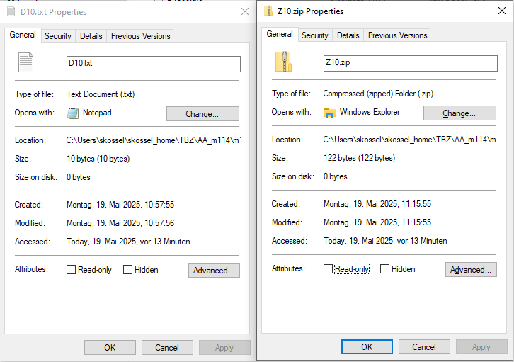

LWZ braucht kein Wörterbuch für Dekomprimierung wie bei Huffmann

## ANANAS LZW
Schritt-für-Schritt
1.
w = ""
k = A
→ "A" ist im Wörterbuch
→ w = "A"

2.
k = N
→ "A"+"N" = "AN" ist nicht im Wörterbuch
→ Ausgabe: Code für "A" (65)
→ "AN" mit Code 256 ins Wörterbuch
→ w = "N"

3.
k = A
→ "N"+"A" = "NA" ist nicht im Wörterbuch
→ Ausgabe: Code für "N" (78)
→ "NA" mit Code 257 ins Wörterbuch
→ w = "A"

4.
k = N
→ "A"+"N" = "AN" ist im Wörterbuch (256)
→ w = "AN"

5.
k = A
→ "AN"+"A" = "ANA" ist nicht im Wörterbuch
→ Ausgabe: Code für "AN" (256)
→ "ANA" mit Code 258 ins Wörterbuch
→ w = "A"

6.
k = S
→ "A"+"S" = "AS" ist nicht im Wörterbuch
→ Ausgabe: Code für "A" (65)
→ "AS" mit Code 259 ins Wörterbuch
→ w = "S"

7.
Nichts mehr übrig, gib Code für "S" (83) aus.

Ausgabe: 
A N 256 A S

256 weil "AN" erster Eintrag im Wörterbuch ist

### Aufgabe B)

Input: E R D B E <256> K L <260>

Output Dekodierung: E R D B E ER K L EE

E + ER = EE
E + erstes wort also E = EE

## BWT Verfahren

## ZIP
1. Erstellen sie die Datei D10.txt als ANSI-ASCII-Datei mit 10 zufällig gewählten Zeichen.
2. Nun D100.txt mit 100 zufällig gewählten Zeichen.
3. Danach D1000.txt mit 1’000 zufällig gewählten Zeichen.
4. Jetzt D10000.txt: mit 10’000 zufällig gewählten Zeichen.
5. Schlussendlich D100000.txt mit 100’000 zufällig gewählten Zeichen.
6. Erstellen sie mit D10.txt die ZIP-Datei Z10.zip
7. Nun mit D100.txt die ZIP-Datei Z100.zip
8. Danach mit D1000.txt die ZIP-Datei Z1000.zip
9. Jetzt mit D10000.txt die ZIP-Datei Z10000.zip
10. Schlussendlichmit D100000.txt die ZIP-Datei Z100000.zip
11. Erfassen sie nun in einer EXCEL-Tabelle die Speichergrössen aller ASCII-Dateien und den entsprechenden ZIP-Dateien. (Siehe Datei/Eigenschaften/Grösse (Nicht Grösse auf dem Datenträger!)
12. Wie interpretieren bzw. begründen sie ihr Resultat?
   Tipp: Sie können in EXCEL Zahlenreihen auch grafisch anzeigen.

Antwort: 100'000 Zeichen wurden in ZIP Format um Faktor 50 verkleinert zu 2KB.
10'000 Zeichen wurden in ZIP Format um Faktor 10 verkleinert zu 1KB.
1'000, 100, 10 wurden nicht verkleinert, sondern sind immernoch 1 KB gross.

Grund: bei kleineren Dateien ist der Overhead (ZIP) grösser als die Komprimierung.
13. Erstellen sie eine ASCII-Textdatei mit 100'000 mal dem Buchstaben A und zippen sie diese.
   Vergleichen sie nun die beiden ZIP-Dateien mit 100'000 Zeichen. Wie erklären sie sich den
   Unterschied der Speichergrössen?

Antwort:
als TXT 98KB Speicherplatz und als ZIP 1KB.
Wenn man eine sehr gleichförmige Datei hat (z.B. nur Buchstaben „A“), erkennt ZIP das Muster und kann dadurch sehr viel Speicherplatz sparen – selbst bei grossen Dateien.

15. Was bewirkt ZIP, wenn die Originaldatei (z.B. diese beiden JPG-Bilder) bereits komprimiert vorlieg
1JPG: bei .jpg 257KB und bei .zip 237KB
2JPG: bei .jpg 24KB und bei .zip 17KB
Erklärung: JPG-Dateien sind bereits stark komprimiert; ZIP bringt hier kaum zusätzlichen Nutzen
